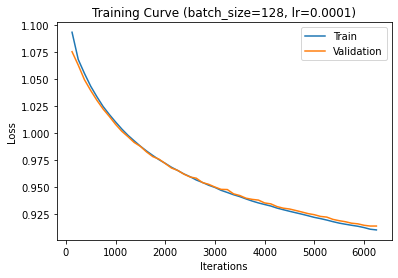
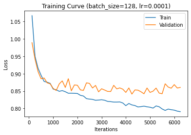

# Artificial Intelligence II 2021-2022 <br/> Assignment 2
####  Michalis Volakis (1115201800022)


## Table of Contents

  * [Analysis of a Vaccine Sentiment Classifier with Deep Learning for Natural Language Processing](#analysis-of-a-vaccine-sentiment-classifier-with-deep-learning-for-natural-language-processing)
  * [Testing the model](#testing-the-model)
  * [Experimentation with Different Hyperparameters of the Neural Network](#experimentation-with-different-hyperparameters-of-the-neural-network)
  * [Number of Hidden Layers](#number-of-hidden-layers)
  * [Number of Hidden Nodes](#number-of-hidden-nodes)
  * [Learning Rate](#learning-rate)
  * [Batch Size](#batch-size)
  * [Experimenting with Different Optimizers](#experimenting-with-different-optimizers)
    * [SGD](#sgd)
        + [Stochastic Gradient Descent with Momentum and Weight Decay](#stochastic-gradient-descent-with-momentum-and-weight-decay)
        + [Comparison of SGD with NAdam](#comparison-of-sgd-with-nadam)
        + [Using Momentum with SGD](#using-momentum-with-sgd)
        + [Using Weight Decay with SGD](#using-weight-decay-with-sgd)
    * [Adabound](#adabound)
  * [The Default Model with GloVe](#the-default-model-with-glove) 
  * [Comparing the Default GloVe Model with a Data Preprocessed,Vectorized Model](#comparing-the-default-glove-model-with-a-data-preprocessed-vectorized-model)
    + [Using the TFIDF Vectorizer](#using-the-tfidf-vectorizer)
  * [Conclusion](#conclusion)
  * [Citation](#citation)

## Analysis of a Vaccine Sentiment Classifier with Deep Learning for Natural Language Processing

In this assignment we experimented with different options and hyperparameters of a deep learning classifier which was trained on vaccine sentiment data and used to decide if a specific piece of text (in this case a tweet) can be labelled as neutral,anti-vax or pro-vax. The following steps were taken to create the classifier:
- ML Libraries Imports (Sklearn,Pandas,Pytorch)
- Loading the datasets and creating the dataframes 
- Creating,Transforming and Summing the tweet embeddings
- Creating the Train and Validation Tensors
- Defining the Neural Network Architecture
- Defining the Optimizer,Loss Function and Hyperparameters
- Training the Neural Network in Batches for the given epochs
- Evaluating the model from the validation set by calculating precision,recall and f1 scores and plotting its learning curve,f1 score,precision,recall and ROC Curve.

## Testing the model
 **To run the model with a test set simply replace this line:**
```python 
df_val  = pd.read_csv("./vaccine_validation_set.csv")
```

## Experimentation with Different Hyperparameters of the Neural Network

**The following experimentations used the NAdam Optimizer**

## Number of Hidden Layers

We experimented with a range of different number of layers in the neural network. In general we found that with small number of layers(1-2) the epoch time decreases since the model is simpler and the training is faster. However, with more layers the model becomes more complex, the training time increases and it tends to either overfit or to underperform (low f1 score,high loss).
> We found that the optimal number of layers is 1-2 since the model is neither too complex nor too simple. 

>The default number of epochs is 50.

**1 Layer (64)** 


**2 Layers (128,64)** 


**3 Layers (256,128,64)** 


## Number of Hidden Nodes

By incrementing the number of hidden nodes we observed that the complexity as well as the training time of the model increases. This happens because the gradient diminishes fast in deep architectures and the errors become very small after a few epochs. The model tends to have severe overfit as the validation loss is much higher than the training loss.

> We found that the optimal number of hidden nodes is 64-128.

**Training Curve with 64 Nodes(left) vs 512 Nodes (right)**


## Learning Rate

The learning rate controls the models ability to learn new patterns and the speed with which it adapts to the problem. As a general rule we found out that very large learning rates can lead to rapid changes and in turn to overfitting as the model converges faster than normal. On the contrary very small learning rates result in slower training times and convergence. However a smaller learning rate can reduce overfitting as well as increase the generalization capability of the model since there are smaller changes to the weights in each epoch. 
> We found that the optimal learning rate is 0.0001.

**Learning Rate = 1e-4**


**Learning Rate = 1e-3**


**Learning Rate = 1e-2**


## Batch Size

By changing the batch size we noticed that the model's training time varies significantly since there are more/less iterations in each epoch. Higher batch sizes lead to less time elapsed in each epoch and in higher memory usage and the model converges faster whereas smaller batch size lead to the opposite effect.  From the following graphs it also clear that the model overfits less with larger batch_sizes whereas it performs better with smaller batch_sizes.

> We found that the optimal batch size is 128.

**Batch Size = 64**


**Batch Size = 128**


**Batch Size = 512**


## Experimenting with Different Optimizers 

## SGD

### Stochastic Gradient Descent with Momentum and Weight Decay

With SGD (Stochastic Gradient Descent) we experimented with different optimizers and hyperparameters. We found that the SGD with momentum and weight decay performs better than the SGD with no momentum and no weight decay (Vanilla SGD).

### Comparison of SGD with NAdam

In general SGD is algorithmically more stable and it attains a smaller generalization error (difference between training and validation error) than Adam. It also minimizes training time and prevents overfitting[12]. However, Adam is more efficient as it retains a higher f1 score and achieves a lower loss which can lead in failing to converge. 


**SGD(left figure) vs NAdam (right figure)**


### Using Momentum with SGD

We found out that by using momentum the model significantly improves its performance as it reduces its loss and its f1 score[1]. However, momentum tends to slightly overfit as the model tends to increase its generalization error and is impacted more from bigger changes in the weights.

> We found that it is better to add momentum to the optimizer rather than using Vanilla SGD.

**No Momentum (left figure) vs Momentum = 0.8**





### Using Weight Decay with SGD

With weight decay we found out similar results with momentum. Since the weight decay is an additional term in the weight update rule that results in the weights to exponentially decay to zero, we notice that in each epoch the weights become smaller and less important to the model. However, even though the weights are smaller, the model still overfits more than the default SGD (no momentum, no weight decay).

> We found that it is better to add weight decay to the optimizer rather than using Vanilla SGD.

**No Decay (left figure) vs Decay = 0.0001 (right figure)**


## Adabound

We also experimented with a newer optimizer called Adabound. Since Adabound is not included in the original PyTorch library, we download and import it seperately. Adabound is a variant of Adam that adapts the learning rate based on the magnitude of the gradients and is designed to be more robust to extreme learning rates[3]. However since we are using a smaller learning rate, the model does not seem to perform better than the other two. Therefore we stick with SGD/Adam.


**Differences between SGD(left figure), Adam(middle figure) and Adabound(right figure)**





## The Default Model with GloVe 
- Optimizer = NAdam
- Batch Size = 128
- Learning Rate = 1e-4
- Epochs = 50


## Comparing the Default GloVe Model with a Data Preprocessed,Vectorized Model

*To find out if the GloVe model is also better than a vectorized model, we also created another model that uses standard data-preprocessing (reducing unneccessary words) and vectorization (converting words to vectors) with CountVectorizer.*

By comparing the default GloVe model with a count vectorized model without word embeddings we noticed a dramatic decrease in the model's performance (significant decrease in the loss and increase in the f1 score). This is because the GloVe model is not able to learn the words that are not in the vocabulary of the model (word embeddings).

**Differences between GloVe Model(left figure) and Vectorized Model(right figure)**


### Using the TFIDF Vectorizer
We also tested the performance of the model with the tfidf vectorizer instead of the count vectorizer. We found that the tfidf vectorizer reduces overfitting but performs slightly worse than the second one.

**Differences between GloVe Model(left figure) and TFIDF Vectorized Model(right figure)**


## Conclusion

Through the above experimentations we came to the conclusion that by using word embeddings with the GloVe Model we tend to improve the ability of the neural network to generalize and perform better as it tends to not overfit. However its performance is noticeably worse than a softmax,vectorized model since it is constrained in the vocabulary of the GloVe model.

## Citation

[1]  Ilya Sutskever, James Martens, George Dahl, Geoffrey Hinton - On the importance of initialization and momentum in deep learning (https://www.cs.toronto.edu/%7Ehinton/absps/momentum.pdf) 

[2] Moritz Hardt, Benjamin Recht, Yoram Singer - Train faster, generalize better: Stability of stochastic gradient descent(http://proceedings.mlr.press/v48/hardt16.pdf)

[3]Liangchen Luo, Yuanhao Xiong, Yan Liu, Xu Sun - Adaptive Gradient Methods with  Dynamic Bound of Learning Rate (https://openreview.net/pdf?id=Bkg3g2R9FX)# ML-Vaccine-Sentiment-Classifier
